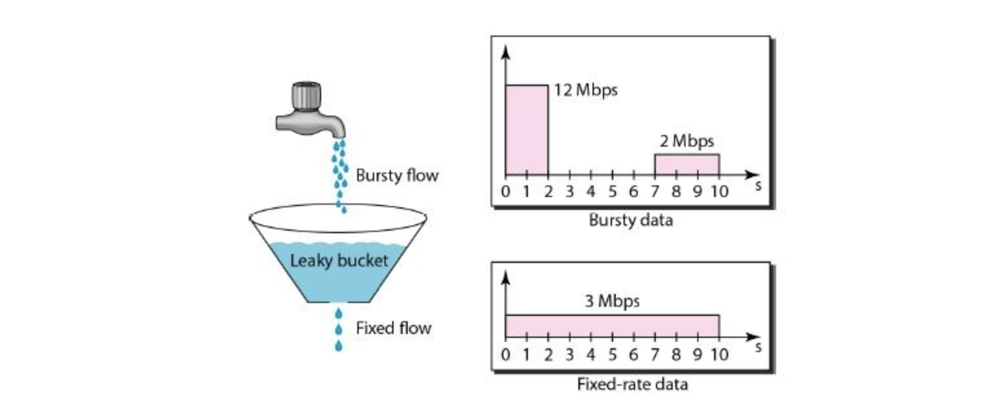

### 1.背景

限流在技术层面，是一种主动调整流量输出速率的措施，它能够采取一定的方法控制指定时间段内发送的流量，有助于减少拥堵。限流控制最早主要用于与网络设备端口流量速率控制，在1997年，思科就提出：专利《采用令牌漏桶进行报文限流的方法》，在2017年 阿里巴巴集团就互联网场景限流，申请的《基于令牌桶进行限流的方法、装置和设备》专利发布，目前此限流广泛在Web应用中使用该技术用于控制网络请求与处理速率。目前互联网服务流量场景，主要算法包括有：固定时间窗口算法、令牌桶算法、漏桶算法等。

### 2.固定时间窗口算法

这个算法的思想很简单，每当一个请求到来时，我们就将计数器加一，当计数器数值超过阈值后，就拒绝余下请求。一秒钟后，我们将计数器清零，开始新一轮的计数。计数器算法简单粗暴，易于实现。但是缺点也是有的，也就是所谓的"突刺现象"。举例说明一下，假如我们给计数器设置的阈值为100。系统瞬间内（比如10毫秒内）有200个请求到来，这个时候计数器只能放过其中的100个请求，余下的100个请求全部被拒绝掉。如果第二秒内没有请求到来，那么系统就处于空闲状态。也就是上一秒忙的要死，这一秒又闲的要死。如果我们能用一个容器将剩余的100个请求缓存起来，待计数器重置后再将这些请求放出来。这样系统在这两秒内的吞吐量就由100变成了200，提升了一倍。基于这个思考，下面我们再来看看漏桶算法。

```java
public class CountLimiter extends Limiter {

    /** 时间窗口 **/
    private static final int TIME_WINDOW = 1000;

    /** 计数器 **/
    private int count;

    /** 时间戳 **/
    private long lastTime;

    public CountLimiter(int qps) {
        super(qps);
        count = 0;
        lastTime = 0;
    }

    @Override
    public synchronized boolean tryAcquire() {
        long now = System.currentTimeMillis();
        if (now - lastTime > TIME_WINDOW) {
            // 保证时间戳后三位都是0.（是否这么做不太影响最后实现，但这样更精确）
            lastTime = now>>3<<3;
            count = 1;
            return true;
        } else if (count < qps) {
            count++;
            return true;
        } else {
            return false;
        }
    }
}
```

### 3.漏桶算法

漏桶算法由流量容器、流量入口和出口组成。其中流量出口流速即为我们期望的限速值，比如 100 QPS。漏桶算法除了具备限流能力，还具备流量整型功能。



流入漏桶流量的流速是不恒定的，经过漏桶限速后，流出流量的速度是恒定的。需要说明的是，漏桶的容量是有限的，一旦流入流量超出漏桶容量，这部分流量只能被丢弃了。漏桶是一个比较好的限流整型工具，不过漏桶不能处理突发流量，一些观点认为这是它的一个缺点。不过如果较起真来，我觉得这个缺点是不成立的。毕竟漏桶本就是用来平滑流量的，如果支持突发，那么输出流量反而不平滑了。如果要找一种能够支持突发流量的限流算法，那么令牌桶算法可以满足需求。

```java
public class LeakyBucketLimiter extends Limiter {

    /** 水桶容量, 一秒流光 **/
    private final long capacity;

    /** 目前水桶剩下的水量 **/
    private double remainWater;

    /** 时间戳 **/
    private long lastTime;

    LeakyBucketLimiter(int qps) {
        super(qps);
        capacity = qps;
        remainWater = capacity;
        lastTime = 0;
    }

    @Override
    public synchronized boolean tryAcquire() {
        long now = System.currentTimeMillis();
        // 计算这段时间匀速流出的水
        double outWater = ((now - lastTime)/1000.0)*capacity;
        lastTime = now;
        if (outWater > remainWater) {
            // 请求已全部处理完毕
            remainWater = 1;
            return true;
        } else {
            // 还有未处理的请求
            remainWater -= outWater;
            if (remainWater + 1 <= capacity) {
                remainWater += 1;
                return true;
            } else {
                return false;
            }
        }
    }
}
```

### 4.令牌桶算法

令牌桶和漏桶颇有几分相似，只不过令牌通里存放的是令牌。它的运行过程是这样的，一个令牌工厂按照设定值定期向令牌桶发放令牌。当令牌桶满了后，多出的令牌会被丢弃掉。每当一个请求到来时，该请求对应的线程会从令牌桶中取令牌。初期由于令牌桶中存放了很多个令牌，因此允许多个请求同时取令牌。当桶中没有令牌后，无法获取到令牌的请求可以丢弃，或者重试。


```java
public class TokenBucketLimiter extends Limiter {

    /** 桶内能装多少令牌 **/
    final int capacity;

    /** 现在桶内令牌数量 **/
    int curTokenNum;

    /** 时间戳 **/
    long lastTime;

    TokenBucketLimiter(int qps) {
        super(qps);
        capacity = qps;
        curTokenNum = 0;
        lastTime = 0;
    }

    @Override
    public synchronized boolean tryAcquire() {
        long now = System.currentTimeMillis();
        int intoToken = (int)((now - lastTime)/1000.0 * capacity);
        lastTime = now;
        if (intoToken + curTokenNum > capacity) {
            // 令牌已放满
            curTokenNum = capacity - 1;
            return true;
        } else if (intoToken + curTokenNum >= 1) {
            // 还有令牌
            curTokenNum = intoToken + curTokenNum - 1;
            return true;
        } else {
            return false;
        }
    }
}
```

