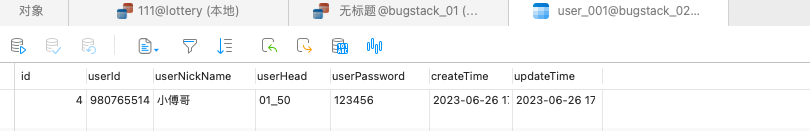
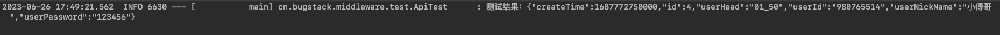

## 一、需求背景

数据库路由的需求背景主要来自于业务体量的增加，让原有的技术设计和实现不能承载现有增加的业务规模和体量，因此需要设计分库分表。

无论应用程序在最初设计的时候就要分库分表，还是因为业务体量的增加而分库分表，都需要考虑运用什么组件、使用什么方式，来分库分表。可以考虑ShardingSphere、MyCat等类似的组件，也可以考虑自行实现一个路由组件。

## 二、方案设计

应用程序的数据库路由设计，主要考虑在结合SpringBoot以后，该如何动态切换数据源以及路由散列的计算。因为分库分表的核心目的是把数据均匀的散列到各个库表中，减轻单库表的事务操作压力。

路由组件主要包括以下内容：

- 数据库连接池的配置，分库分表需要按需配置数据库连接源，在这些连接池的集合中进行动态切换操作。
- AbstractRoutingDataSource，是用于动态切换数据源的Spring服务类，它提供了获取数据源的抽象方法determineCurrentLookupKey。
- 最后非常重要也是整个数据库路由设计的核心，就是关于路由的计算。在路由计算中需要获取用于分库分表的字段，通过哈希值的计算以及扰动最终达到尽可能的散列，让数据均匀分散到各个库表中。散列的计算使用的是HashMap扰动函数的散列计算方式。

## 三、技术实现

#### 1.工程结构

> ```
> src
> ├── main
> │   ├── java
> │   │   └── cn
> │   │       └── bugstack
> │   │           └── middleware
> │   │               └── db
> │   │                   └── router
> │   │                       ├── DBContextHolder.java
> │   │                       ├── DBRouterBase.java
> │   │                       ├── DBRouterConfig.java
> │   │                       ├── DBRouterJoinPoint.java
> │   │                       ├── annotation
> │   │                       │   ├── DBRouter.java
> │   │                       │   └── DBRouterStrategy.java
> │   │                       ├── config
> │   │                       │   └── DataSourceAutoConfig.java
> │   │                       ├── dynamic
> │   │                       │   ├── DynamicDataSource.java
> │   │                       │   └── DynamicMybatisPlugin.java
> │   │                       ├── strategy
> │   │                       │   ├── IDBRouterStrategy.java
> │   │                       │   └── impl
> │   │                       │       └── DBRouterStrategyHashCode.java
> │   │                       └── util
> │   │                           └── PropertyUtil.java
> │   └── resources
> │       └── META-INF
> │           └── spring.factories
> └── test
>     └── java
>         └── cn
>             └── bugstack
>                 └── middleware
>                     └── test
>                         ├── ApiTest.java
>                         └── IUserDao.java
> ```

在整个数据库路由实现中，包括了注解、配置、动态数据源以及切面中实现的路由计算，这些功能概述如下：

- DBRouter，负责设置需要被路由处理的DAO方法，作用到接口层。
- DataSourceAutoConfig，SpringBoot中用于自动化加载配置的类，主要包括配置的读取和数据源的创建。
- DBRouterJoinPoint，是整个数据库路由计算的核心类。

#### 2.路由注解定义

```java
@Documented
@Retention(RetentionPolicy.RUNTIME)
@Target({ElementType.TYPE, ElementType.METHOD})
public @interface DBRouter {

    /** 分库分表字段 */
    String key() default "";

}
```

路由注解的目的是为了切面提供切点，同时获取方法中入参属性的某个字段，这个字段会作为路由字段存在。

#### 3.本地线程设置路由结果

```java
public class DBContextHolder {

    private static final ThreadLocal<String> dbKey = new ThreadLocal<String>();
    private static final ThreadLocal<String> tbKey = new ThreadLocal<String>();

    public static void setDBKey(String dbKeyIdx){
        dbKey.set(dbKeyIdx);
    }

    public static String getDBKey(){
        return dbKey.get();
    }

    public static void setTBKey(String tbKeyIdx){
        tbKey.set(tbKeyIdx);
    }

    public static String getTBKey(){
        return tbKey.get();
    }

    public static void clearDBKey(){
        dbKey.remove();
    }

    public static void clearTBKey(){
        tbKey.remove();
    }

}
```

使用了两个本地线程变量，用来记录分库分表的路由结果。

#### 4.动态数据源类

```java
public class DynamicDataSource extends AbstractRoutingDataSource {

    @Override
    protected Object determineCurrentLookupKey() {
        return "db" + DBContextHolder.getDBKey();
    }

}
```

动态数据源需要继承AbstractRoutingDataSource实现determineCurrentLookupKey方法，这个方法中使用DBContextHolder.getDBKey()，获取路由设置到ThreadLocal的结果。

#### 5.配置加载和创建数据源

```java
@Configuration
public class DataSourceAutoConfig implements EnvironmentAware {

    /**
     * 数据源配置组
     */
    private Map<String, Map<String, Object>> dataSourceMap = new HashMap<>();

    /**
     * 默认数据源配置
     */
    private Map<String, Object> defaultDataSourceConfig;

    /**
     * 分库数量
     */
    private int dbCount;

    /**
     * 分表数量
     */
    private int tbCount;

    /**
     * 路由字段
     */
    private String routerKey;

    @Bean(name = "db-router-point")
    @ConditionalOnMissingBean
    public DBRouterJoinPoint point(DBRouterConfig dbRouterConfig, IDBRouterStrategy dbRouterStrategy) {
        return new DBRouterJoinPoint(dbRouterConfig, dbRouterStrategy);
    }

    @Bean
    public DBRouterConfig dbRouterConfig() {
        return new DBRouterConfig(dbCount, tbCount, routerKey);
    }

    @Bean
    public Interceptor plugin() {
        return new DynamicMybatisPlugin();
    }

    @Bean
    public DataSource dataSource() {
        // 创建数据源
        Map<Object, Object> targetDataSources = new HashMap<>();
        for (String dbInfo : dataSourceMap.keySet()) {
            Map<String, Object> objMap = dataSourceMap.get(dbInfo);
            targetDataSources.put(dbInfo, new DriverManagerDataSource(objMap.get("url").toString(), objMap.get("username").toString(), objMap.get("password").toString()));
        }

        // 设置数据源
        DynamicDataSource dynamicDataSource = new DynamicDataSource();
        dynamicDataSource.setTargetDataSources(targetDataSources);
        dynamicDataSource.setDefaultTargetDataSource(new DriverManagerDataSource(defaultDataSourceConfig.get("url").toString(), defaultDataSourceConfig.get("username").toString(), defaultDataSourceConfig.get("password").toString()));

        return dynamicDataSource;
    }

    @Bean
    public IDBRouterStrategy dbRouterStrategy(DBRouterConfig dbRouterConfig) {
        return new DBRouterStrategyHashCode(dbRouterConfig);
    }

    @Bean
    public TransactionTemplate transactionTemplate(DataSource dataSource) {
        DataSourceTransactionManager dataSourceTransactionManager = new DataSourceTransactionManager();
        dataSourceTransactionManager.setDataSource(dataSource);

        TransactionTemplate transactionTemplate = new TransactionTemplate();
        transactionTemplate.setTransactionManager(dataSourceTransactionManager);
        transactionTemplate.setPropagationBehaviorName("PROPAGATION_REQUIRED");
        return transactionTemplate;
    }

    @Override
    public void setEnvironment(Environment environment) {
        String prefix = "mini-db-router.jdbc.datasource.";

        dbCount = Integer.valueOf(environment.getProperty(prefix + "dbCount"));
        tbCount = Integer.valueOf(environment.getProperty(prefix + "tbCount"));
        routerKey = environment.getProperty(prefix + "routerKey");

        // 分库分表数据源
        String dataSources = environment.getProperty(prefix + "list");
        assert dataSources != null;
        for (String dbInfo : dataSources.split(",")) {
            Map<String, Object> dataSourceProps = PropertyUtil.handle(environment, prefix + dbInfo, Map.class);
            dataSourceMap.put(dbInfo, dataSourceProps);
        }

        // 默认数据源
        String defaultData = environment.getProperty(prefix + "default");
        defaultDataSourceConfig = PropertyUtil.handle(environment, prefix + defaultData, Map.class);

    }
}
```

整个DataSourceAutoConfig，数据源自动加载配置类，提供了三块功能：

- setEnvironment，读取自定义配置，因为我们要设置的是一个在yml配置多组数据源，这个方法就是为了解析下面的配置信息。

> ```yaml
> router:
>   jdbc:
>     datasource:
>       dbCount: 2
>       tbCount: 4
>       list: db01,db02
>       db01:
>         driver-class-name: com.mysql.jdbc.Driver
>         url: jdbc:mysql://127.0.0.1:3306/bugstack_01?useUnicode=true
>         username: root
>         password: 429006huzhuo
>       db02:
>         driver-class-name: com.mysql.jdbc.Driver
>         url: jdbc:mysql://127.0.0.1:3306/bugstack_02?useUnicode=true
>         username: root
>         password: 429006huzhuo
> ```

- dataSource方法是为了创建动态数据源，这个数据源就会被MyBatis SpringBoot Starter中SqlSessionFactory sqlSessionFactory(DataSource dataSource)注入使用。
- dbRouterConfig()主要是为了把分库分表配置成一个Bean对象，方便在切面类中注入使用。

#### 6.数据库路由计算

```java
@Aspect
public class DBRouterJoinPoint {

    private Logger logger = LoggerFactory.getLogger(DBRouterJoinPoint.class);

    private DBRouterConfig dbRouterConfig;

    private IDBRouterStrategy dbRouterStrategy;

    public DBRouterJoinPoint(DBRouterConfig dbRouterConfig, IDBRouterStrategy dbRouterStrategy) {
        this.dbRouterConfig = dbRouterConfig;
        this.dbRouterStrategy = dbRouterStrategy;
    }

    @Pointcut("@annotation(cn.bugstack.middleware.db.router.annotation.DBRouter)")
    public void aopPoint() {
    }

    @Around("aopPoint() && @annotation(dbRouter)")
    public Object doRouter(ProceedingJoinPoint jp, DBRouter dbRouter) throws Throwable {
        String dbKey = dbRouter.key();
        if (StringUtils.isBlank(dbKey) && StringUtils.isBlank(dbRouterConfig.getRouterKey())) {
            throw new RuntimeException("annotation DBRouter key is null！");
        }
        dbKey = StringUtils.isNotBlank(dbKey) ? dbKey : dbRouterConfig.getRouterKey();
        // 路由属性
        String dbKeyAttr = getAttrValue(dbKey, jp.getArgs());
        // 路由策略
        dbRouterStrategy.doRouter(dbKeyAttr);
        // 返回结果
        try {
            return jp.proceed();
        } finally {
           dbRouterStrategy.clear();
        }
    }

    private Method getMethod(JoinPoint jp) throws NoSuchMethodException {
        Signature sig = jp.getSignature();
        MethodSignature methodSignature = (MethodSignature) sig;
        return jp.getTarget().getClass().getMethod(methodSignature.getName(), methodSignature.getParameterTypes());
    }

    public String getAttrValue(String attr, Object[] args) {
        if (1 == args.length) {
            Object arg = args[0];
            if (arg instanceof String) {
                return arg.toString();
            }
        }

        String filedValue = null;
        for (Object arg : args) {
            try {
                if (StringUtils.isNotBlank(filedValue)) {
                    break;
                }
                filedValue = BeanUtils.getProperty(arg, attr);
            } catch (Exception e) {
                logger.error("获取路由属性值失败 attr：{}", attr, e);
            }
        }
        return filedValue;
    }

}
```

路由策略：

```java
public class DBRouterStrategyHashCode implements IDBRouterStrategy {

    private Logger logger = LoggerFactory.getLogger(DBRouterStrategyHashCode.class);

    private DBRouterConfig dbRouterConfig;

    public DBRouterStrategyHashCode(DBRouterConfig dbRouterConfig) {
        this.dbRouterConfig = dbRouterConfig;
    }

    @Override
    public void doRouter(String dbKeyAttr) {
        int size = dbRouterConfig.getDbCount() * dbRouterConfig.getTbCount();

        // 扰动函数
        int idx = (size - 1) & (dbKeyAttr.hashCode() ^ (dbKeyAttr.hashCode() >>> 16));

        // 库表索引；相当于是把一个长条的桶，切割成段，对应分库分表中的库编号和表编号
        int dbIdx = idx / dbRouterConfig.getTbCount() + 1;
        int tbIdx = idx - dbRouterConfig.getTbCount() * (dbIdx - 1);

        DBContextHolder.setDBKey(String.format("%02d", dbIdx));
        DBContextHolder.setTBKey(String.format("%03d", tbIdx));
        logger.debug("数据库路由 dbIdx：{} tbIdx：{}",  dbIdx, tbIdx);
    }

    @Override
    public void setDBKey(int dbIdx) {
        DBContextHolder.setDBKey(String.format("%02d", dbIdx));
    }

    @Override
    public void setTBKey(int tbIdx) {
        DBContextHolder.setTBKey(String.format("%03d", tbIdx));
    }

    @Override
    public int dbCount() {
        return dbRouterConfig.getDbCount();
    }

    @Override
    public int tbCount() {
        return dbRouterConfig.getTbCount();
    }

    @Override
    public void clear(){
        DBContextHolder.clearDBKey();
        DBContextHolder.clearTBKey();
    }
}
```

- dbRouterConfig，是我们注入的数据库路由配置信息
- aopPoint，是定义的切点，也就是注解用在DAO后，会被切面拦截
- dbRouter，切面拦截后的具体操作，也就是数据库路由的计算和设置

数据库路由计算

1.在数据库路由的计算过程中，需要使用getAttrValue解析出路由字段。

2.通过数据库路由字段，计算整个库表的总数量，dbRouterConfig.getDbCount() * dbRouterConfig.getTbCount()，默认设置为2的n次方大小

3.哈希和扰动函数，扰动函数是为了让数据存储更加散列。

## 四、测试验证

#### 1.工程结构

> ```
> src
> ├── main
> │   ├── java
> │   │   └── cn
> │   │       └── bugstack
> │   │           └── middleware
> │   │               └── test
> │   │                   ├── ApiTestApplication.java
> │   │                   ├── infrastructure
> │   │                   │   ├── dao
> │   │                   │   │   └── IUserDao.java
> │   │                   │   └── po
> │   │                   │       └── User.java
> │   │                   └── interfaces
> │   │                       ├── UserController.java
> │   │                       └── dto
> │   │                           └── UserInfo.java
> │   └── resources
> │       ├── application.yml
> │       └── mybatis
> │           ├── config
> │           │   └── mybatis-config.xml
> │           └── mapper
> │               └── User_Mapper.xml
> └── test
>     └── java
>         └── cn
>             └── bugstack
>                 └── middleware
>                     └── test
>                         └── ApiTest.java
> ```

#### 2.创建库表

```sql
create database bugstack_01;
create database bugstack_02;

create table if not exists `user_001` (
  `id` bigint NOT NULL AUTO_INCREMENT COMMENT '自增ID',
  `userId` varchar(9) CHARACTER SET utf8mb4 COLLATE utf8mb4_0900_ai_ci DEFAULT NULL COMMENT '用户ID',
  `userNickName` varchar(32) CHARACTER SET utf8mb4 COLLATE utf8mb4_0900_ai_ci DEFAULT NULL COMMENT '用户昵称',
	`userHead` varchar(16) CHARACTER SET utf8mb4 COLLATE utf8mb4_0900_ai_ci DEFAULT NULL COMMENT '用户头像',
  `userPassword` varchar(64) CHARACTER SET utf8mb4 COLLATE utf8mb4_0900_ai_ci DEFAULT NULL COMMENT '用户密码',
  `createTime` datetime DEFAULT CURRENT_TIMESTAMP COMMENT '创建时间',
  `updateTime` datetime DEFAULT CURRENT_TIMESTAMP COMMENT '更新时间',
  PRIMARY KEY (`id`)
) ENGINE=InnoDB AUTO_INCREMENT=4 DEFAULT CHARSET=utf8mb4 COLLATE=utf8mb4_bin COMMENT='用户信息';

create table if not exists `user_002` (
  `id` bigint NOT NULL AUTO_INCREMENT COMMENT '自增ID',
  `userId` varchar(9) CHARACTER SET utf8mb4 COLLATE utf8mb4_0900_ai_ci DEFAULT NULL COMMENT '用户ID',
  `userNickName` varchar(32) CHARACTER SET utf8mb4 COLLATE utf8mb4_0900_ai_ci DEFAULT NULL COMMENT '用户昵称',
	`userHead` varchar(16) CHARACTER SET utf8mb4 COLLATE utf8mb4_0900_ai_ci DEFAULT NULL COMMENT '用户头像',
  `userPassword` varchar(64) CHARACTER SET utf8mb4 COLLATE utf8mb4_0900_ai_ci DEFAULT NULL COMMENT '用户密码',
  `createTime` datetime DEFAULT CURRENT_TIMESTAMP COMMENT '创建时间',
  `updateTime` datetime DEFAULT CURRENT_TIMESTAMP COMMENT '更新时间',
  PRIMARY KEY (`id`)
) ENGINE=InnoDB AUTO_INCREMENT=4 DEFAULT CHARSET=utf8mb4 COLLATE=utf8mb4_bin COMMENT='用户信息';

create table if not exists `user_003` (
  `id` bigint NOT NULL AUTO_INCREMENT COMMENT '自增ID',
  `userId` varchar(9) CHARACTER SET utf8mb4 COLLATE utf8mb4_0900_ai_ci DEFAULT NULL COMMENT '用户ID',
  `userNickName` varchar(32) CHARACTER SET utf8mb4 COLLATE utf8mb4_0900_ai_ci DEFAULT NULL COMMENT '用户昵称',
	`userHead` varchar(16) CHARACTER SET utf8mb4 COLLATE utf8mb4_0900_ai_ci DEFAULT NULL COMMENT '用户头像',
  `userPassword` varchar(64) CHARACTER SET utf8mb4 COLLATE utf8mb4_0900_ai_ci DEFAULT NULL COMMENT '用户密码',
  `createTime` datetime DEFAULT CURRENT_TIMESTAMP COMMENT '创建时间',
  `updateTime` datetime DEFAULT CURRENT_TIMESTAMP COMMENT '更新时间',
  PRIMARY KEY (`id`)
) ENGINE=InnoDB AUTO_INCREMENT=4 DEFAULT CHARSET=utf8mb4 COLLATE=utf8mb4_bin COMMENT='用户信息';

create table if not exists `user_004` (
  `id` bigint NOT NULL AUTO_INCREMENT COMMENT '自增ID',
  `userId` varchar(9) CHARACTER SET utf8mb4 COLLATE utf8mb4_0900_ai_ci DEFAULT NULL COMMENT '用户ID',
  `userNickName` varchar(32) CHARACTER SET utf8mb4 COLLATE utf8mb4_0900_ai_ci DEFAULT NULL COMMENT '用户昵称',
	`userHead` varchar(16) CHARACTER SET utf8mb4 COLLATE utf8mb4_0900_ai_ci DEFAULT NULL COMMENT '用户头像',
  `userPassword` varchar(64) CHARACTER SET utf8mb4 COLLATE utf8mb4_0900_ai_ci DEFAULT NULL COMMENT '用户密码',
  `createTime` datetime DEFAULT CURRENT_TIMESTAMP COMMENT '创建时间',
  `updateTime` datetime DEFAULT CURRENT_TIMESTAMP COMMENT '更新时间',
  PRIMARY KEY (`id`)
) ENGINE=InnoDB AUTO_INCREMENT=4 DEFAULT CHARSET=utf8mb4 COLLATE=utf8mb4_bin COMMENT='用户信息';
```

#### 3.配置信息

> ```yaml
> server:
>   port: 7397
> 
> mybatis:
>   mapper-locations: classpath:/mybatis/mapper/*.xml
>   config-location:  classpath:/mybatis/config/mybatis-config.xml
> 
> # 路由配置
> router:
>   jdbc:
>     datasource:
>       dbCount: 2
>       tbCount: 4
>       list: db01,db02
>       db01:
>         driver-class-name: com.mysql.jdbc.Driver
>         url: jdbc:mysql://127.0.0.1:3306/bugstack_01?useUnicode=true
>         username: root
>         password: 429006huzhuo
>       db02:
>         driver-class-name: com.mysql.jdbc.Driver
>         url: jdbc:mysql://127.0.0.1:3306/bugstack_02?useUnicode=true
>         username: root
>         password: 429006huzhuo
> ```

#### 4.Dao接口

```java
@Mapper
public interface IUserDao {

     @DBRouter(key = "userId")
     User queryUserInfoByUserId(User req);

     @DBRouter(key = "userId")
     void insertUser(User req);

}
```

#### 5.单元测试

#### 5.1测试插入

```java
@Test
public void test_insertUser() {
  User user = new User();
  user.setUserId("980765514");
  user.setUserNickName("小傅哥");
  user.setUserHead("01_50");
  user.setUserPassword("123456");
  userDao.insertUser(user);
}
```



#### 5.2测试查询

```java
@Test
public void test_queryUserInfoByUserId() {
  User user = userDao.queryUserInfoByUserId(new User("980765514"));
  logger.info("测试结果：{}", JSON.toJSONString(user));
}
```

