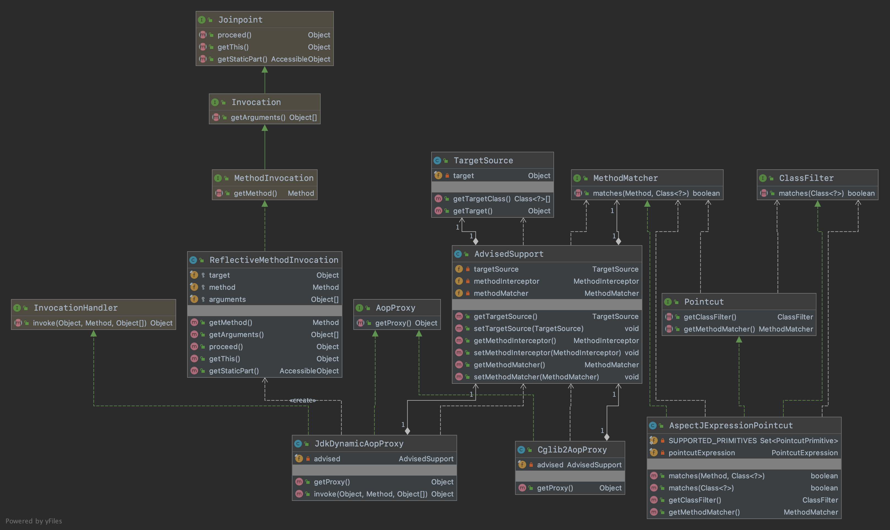
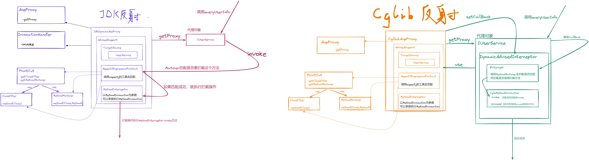

## 基于JDK和Cglib实现AOP切面

#### 1.需求目标

- 基于动态代理实现AOP切面。

#### 2.设计

- 定义 Pointcut接口，切入点接口，定义用于获取 ClassFilter、MethodMatcher 的两个类，这两个接口获取都是切点表达式提供的内容。。
- 定义 ClassFilter接口，类匹配器，用于切点找到给定的接口和目标类。。
- 定义 MethodMatcher接口，方法匹配，找到表达式范围内匹配下的目标类和方法。
- 增加 AspectJExpressionPointcut类，实现切点表达式类，切点表达式实现了 Pointcut、ClassFilter、MethodMatcher，三个接口定义方法，同时这个类主要是对 aspectj 包提供的表达式校验方法使用。
- 增加 AdvisedSupport类，包装切面通知信息，主要是用于把代理、拦截、匹配的各项属性包装到一个类中，方便在 Proxy 实现类进行使用。
- 定义 AopProxy接口，用于获取代理类。因为具体实现代理的方式可以有 JDK 方式，也可以是 Cglib 方式，所以定义接口会更加方便管理实现类。。
- 增加 JdkDynamicAopProxy类，这是基于 JDK 实现的代理类，需要实现接口 AopProxy、InvocationHandler，这样就可以把代理对象 getProxy 和反射调用方法 invoke 分开处理了。getProxy 方法中的是代理一个对象的操作，需要提供入参 ClassLoader、AdvisedSupport、和当前这个类 this，因为这个类提供了 invoke 方法。invoke 方法中主要处理匹配的方法后，使用用户自己提供的方法拦截实现，做反射调用 methodInterceptor.invoke 。这里还有一个 ReflectiveMethodInvocation，是一个入参的包装信息，提供了入参信息：目标对象、方法、入参。
- 增加 Cglib2AopProxy类，这是基于 Cglib实现的代理类，基于 Cglib 使用 Enhancer 代理的类可以在运行期间为接口使用底层 ASM 字节码增强技术处理对象的代理对象生成，因此被代理类不需要实现任何接口。关于扩展进去的用户拦截方法，主要是在 Enhancer#setCallback 中处理，用户自己的新增的拦截处理。这里可以看到 DynamicAdvisedInterceptor#intercept 匹配方法后做了相应的反射操作。

#### 3.类图

#### 4.原理图

