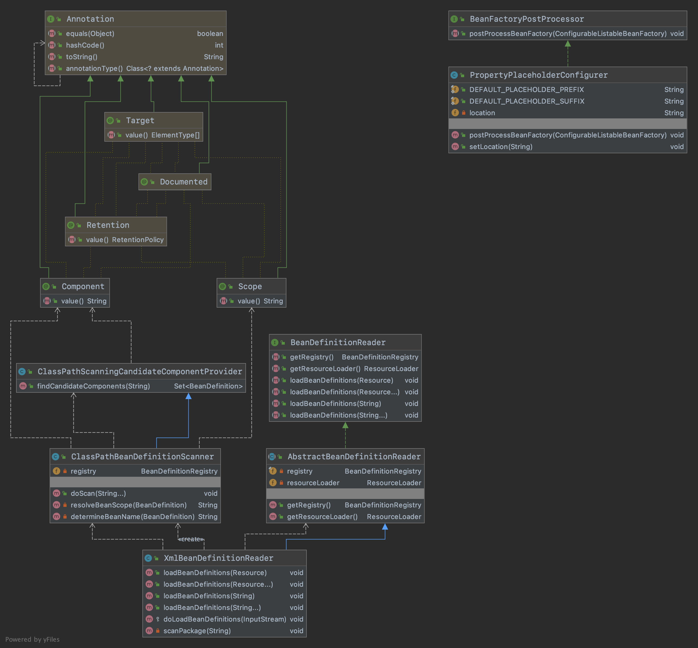

## 自动扫描Bean注册对象

#### 1.需求目标

- 实现通过注解扫描Bean注册对象。
- 支持占位符属性填充。

#### 2.设计

- 增加 PropertyPlaceholderConfigurer类，依赖于 BeanFactoryPostProcessor 在 Bean 生命周期的属性，可以在 Bean 对象实例化之前，改变属性信息。所以这里通过实现 BeanFactoryPostProcessor 接口，完成对配置文件的加载以及摘取占位符中在属性文件里的配置。具体实现先获取属性值，然后将占位符括号里的内容替换为属性值。
- 增加 Scope注解，用于配置作用域的自定义注解，方便通过配置Bean对象注解的时候，拿到Bean对象的作用域。一般使用默认的 singleton。
- 增加 Component注解，用于配置到 Class 类上的。除此之外还有 Service、Controller，不过所有的处理方式基本一致。
- 增加 ClassPathScanningCandidateComponentProvider类， 定义findCandidateComponents方法，通过这个方法可以扫描到所有 @Component 注解的 Bean 对象。
- 增加 ClassPathBeanDefinitionScanner类，是继承自 ClassPathScanningCandidateComponentProvider 的具体扫描包处理的类，在 doScan 中除了获取到扫描的类信息以后，还需要获取 Bean 的作用域和类名，如果不配置类名基本都是把首字母缩写。
- 修改 XmlBeanDefinitionReader类，处理新增的自定义配置属性 component-scan，解析后调用 scanPackage 方法，最终调用的是 ClassPathBeanDefinitionScanner#doScan 功能。

#### 3.类图

#### 4.全貌图

