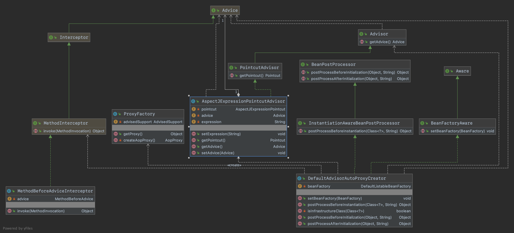
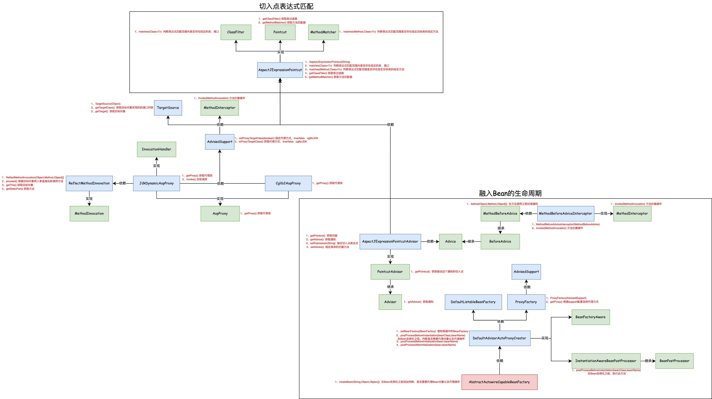

## 把AOP扩展到Bean的生命周期

#### 1.需求目标

- 实现 AOP 核心功能与 Spring 框架的整合。

#### 2.设计

- 定义 BeforeAdvice、MethodBeforeAdvice接口，用于方法拦截。在 Spring 框架中，Advice 都是通过方法拦截器 MethodInterceptor 实现的。环绕 Advice 类似一个拦截器的链路，Before Advice、After advice等。
- 定义 Advisor、PointcutAdvisor接口，PointcutAdvisor 承担了 Pointcut 和 Advice 的组合，Pointcut 用于获取 JoinPoint，而 Advice 决定于 JoinPoint 执行什么操作。
- 增加 AspectJExpressionPointcutAdvisor类，AspectJExpressionPointcutAdvisor 实现了 PointcutAdvisor 接口，把切面 pointcut、拦截方法 advice 和具体的拦截表达式包装在一起。这样就可以在 xml 的配置中定义一个 pointcutAdvisor 切面拦截器了。
- 增加 MethodBeforeAdviceInterceptor类，MethodBeforeAdviceInterceptor 实现了 MethodInterceptor 接口，在 invoke 方法中调用 advice 中的 before 方法，传入对应的参数信息。
- 增加 ProxyFactory类，这个代理工厂主要解决的是关于 JDK 和 Cglib 两种代理的选择问题，有了代理工厂就可以按照不同的创建需求进行控制。
- 增加 DefaultAdvisorAutoProxyCreator类， DefaultAdvisorAutoProxyCreator 类的主要核心实现在于 postProcessBeforeInstantiation 方法，通过 beanFactory.getBeansOfType 获取 AspectJExpressionPointcutAdvisor 。获取了 advisors 以后就可以遍历相应的 AspectJExpressionPointcutAdvisor 填充对应的属性信息，包括：目标对象、拦截方法、匹配器，之后返回代理对象即可。那么现在调用方获取到的这个 Bean 对象就是一个已经被切面注入的对象了，当调用方法的时候，则会被按需拦截，处理用户需要的信息。
- 修改 AbstractAutowireCapableBeanFactory类，因为创建的是代理对象不是之前流程里的普通对象，所以我们需要前置于其他对象的创建，即需要在 AbstractAutowireCapableBeanFactory#createBean 优先完成 Bean 对象的判断，是否需要代理，有则直接返回代理对象。

#### 3.类图

#### 4.原理图

