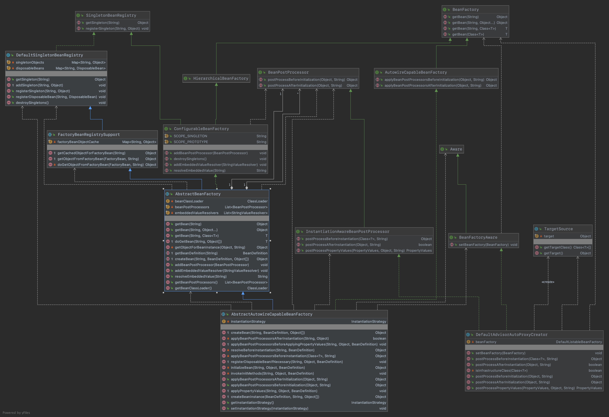
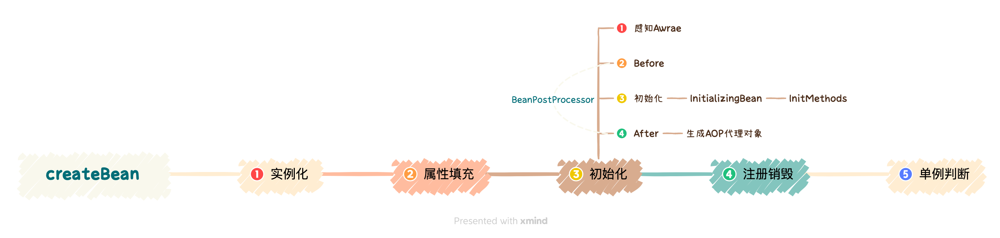

## 给代理对象的属性设置值

#### 1.需求目标

- 实现给代理对象的属性设置值。

#### 2.设计

- 修改 TargetSource类，target 可能是 JDK 代理创建也可能是 CGlib 创建，为了保证都能正确的获取到结果，需要增加判断 ClassUtils.isCglibProxyClass(clazz)。
- 修改 DefaultAdvisorAutoProxyCreator类， 把创建 AOP 代理的操作从 postProcessBeforeInstantiation 移动到 postProcessAfterInitialization 中去。
- 修改 AbstractAutowireCapableBeanFactory类，在 AbstractAutowireCapableBeanFactory#createBean 方法中，变更 initializeBean -> applyBeanPostProcessorsAfterInitialization 这一块逻辑的调用，最终完成 AOP 代理对象的创建操作。。

#### 3.类图

#### 4.原理图

