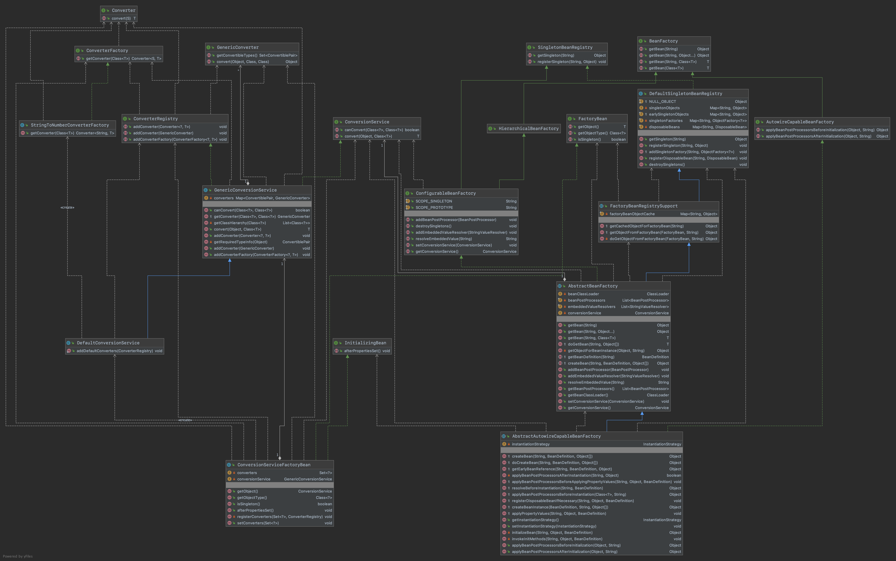
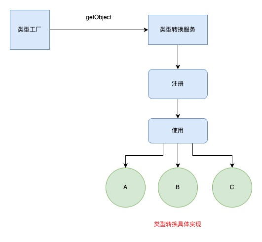

## 数据类型转换工厂设计实现

#### 1.需求目标

- 将数据类型转换功能扩展到Spring框架。

#### 2.设计

- 定义 Converter、ConverterFactory、ConverterRegistry接口，都是用于定义类型转换操作的相关接口，后续所有的实现都需要围绕这些接口来实现。
- 定义 DefaultConversionService类， 是继承 GenericConversionService 的实现类，而 GenericConversionService 实现了 ConversionService, ConverterRegistry 两个接口，用于 canConvert 判断和转换接口 convert 操作。
- 新增 ConversionServiceFactoryBean类，有了 FactoryBean 的实现就可以完成工程对象的操作，可以提供出转换对象的服务 GenericConversionService，另外在 afterPropertiesSet 中调用了注册转换操作的类。最终这个类会被配置到 spring.xml 中在启动的过程加载。
- 修改 AbstractAutowireCapableBeanFactory类，在 AbstractAutowireCapableBeanFactory#applyPropertyValues 填充属性的操作中，具体使用了类型转换的功能。

#### 3.类图

#### 4.原理图

