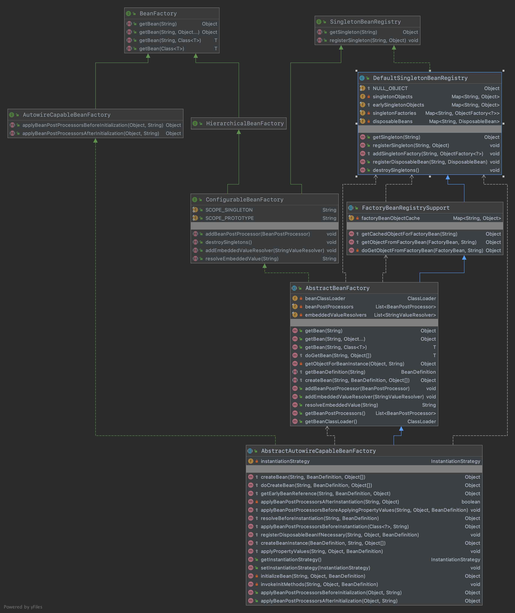
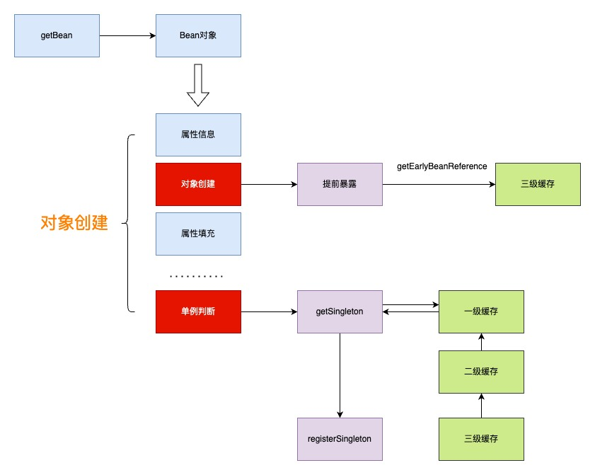

## 通过三级缓存解决循环依赖

#### 1.需求目标

- 解决循环依赖问题。
- 解决代理类的循环依赖问题。

#### 2.设计

- 修改 DefaultSingletonBeanRegistry类，原来只有一个注册表用于缓存单例对象。现在增加两个Map，用于缓存早期的半成品单例对象和单例工厂对象。总共有三个缓存singletonObjects、earlySingletonObjects、singletonFactories。提供获取、添加和注册不同对象的方法，包括：getSingleton、registerSingleton、addSingletonFactory，主要是 getSingleton 的操作，它是在一层层处理不同时期的单例对象，直至拿到有效的对象。
- 修改 AbstractAutowireCapableBeanFactory类， 提前暴露对象。在 AbstractAutowireCapableBeanFactory#doCreateBean 的方法中主要是扩展了对象的提前暴露addSingletonFactory 和单例对象的获取getSingleton以及注册操作registerSingleton。getEarlyBeanReference将代理Bean放到了缓存，避免后续修改代理对象属性值时需要重新创建代理对象。

#### 3.类图

#### 4.原理图

