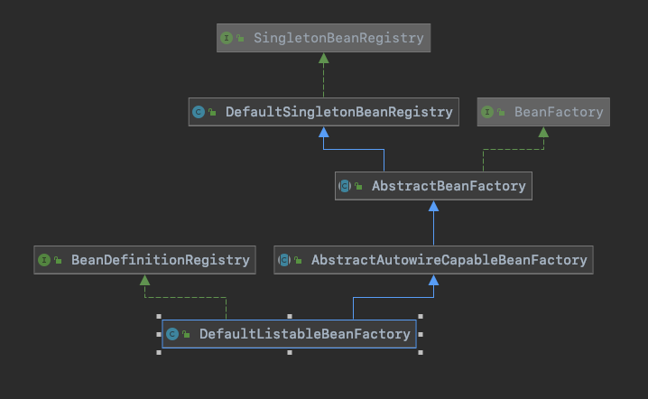
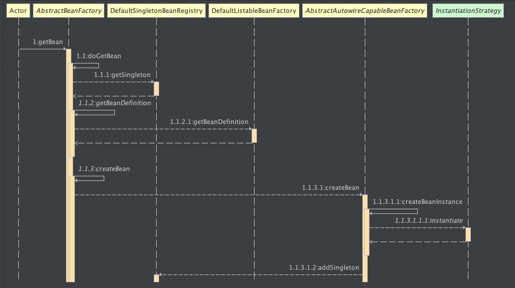

## 基于Cglib实现含构造函数的类实例化策略

#### 1.需求目标

- 增加对有参构造函数进行实例化的支持。
- 扩展实例化方式，增加Cglib实例化策略。

#### 2.设计

- 在BeanFactory接口中，增加getBean的重载方法，支持带参数获取Bean。
- 新增InstantiationStrategy接口，支持JDK动态代理和Cglib两种方式实例化Bean。

#### 3.类图

#### 4.时序图

