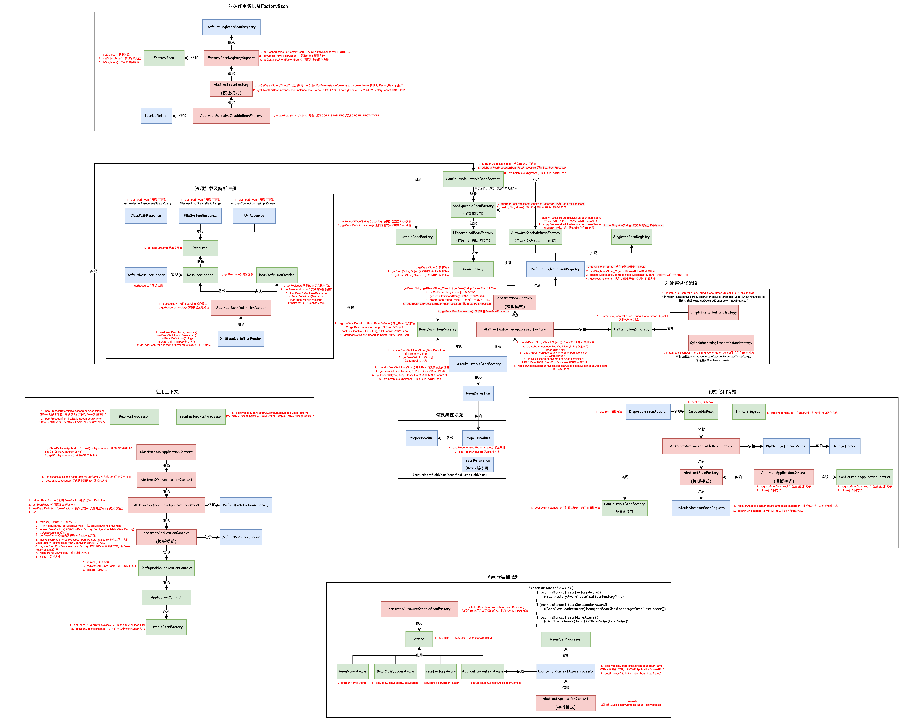
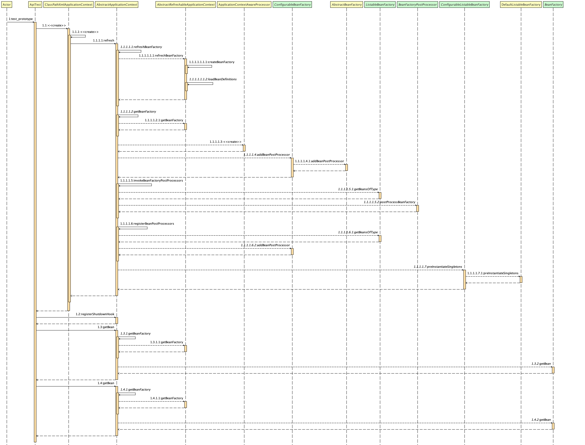

## 对象作用域和FactoryBean

#### 1.需求目标

- 增加Bean作用域，支持单例模式和原型模式。
- 支持代理Bean的注册。

#### 2.设计

- BeanDefinition 新增作用范围属性scope，并且在XmlBeanDefinitionReader解析类中补充对scope的解析。
- 在 AbstractAutowireCapableBeanFactory 的createBean方法中，增加单例和原型的判断，如果是单例，才添加到单例池。并且在注册销毁方法时，如果是单例，则不需注册销毁方法，直接返回。
- 定义 FactoryBean接口，提供获取对象、对象类型、是否单例三个方法。
- 增加 FactoryBeanRegistrySupport类，提供获取FactoryBean的方法，使用缓存设计，如果缓存中有，则从缓存中获取，如果没有，则通过工厂获取，并把Bean添加到缓存。
- 扩展 AbstractBeanFactory类获取doGetBean逻辑，增加对FactoryBean获取的支持。

#### 3.类图

#### 4.时序图

