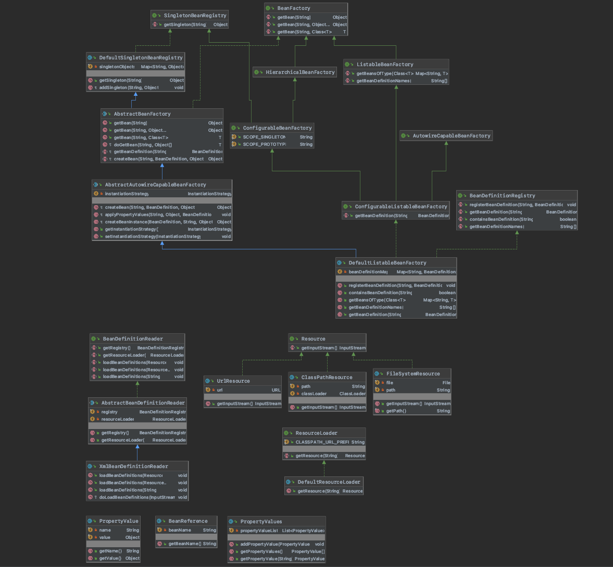
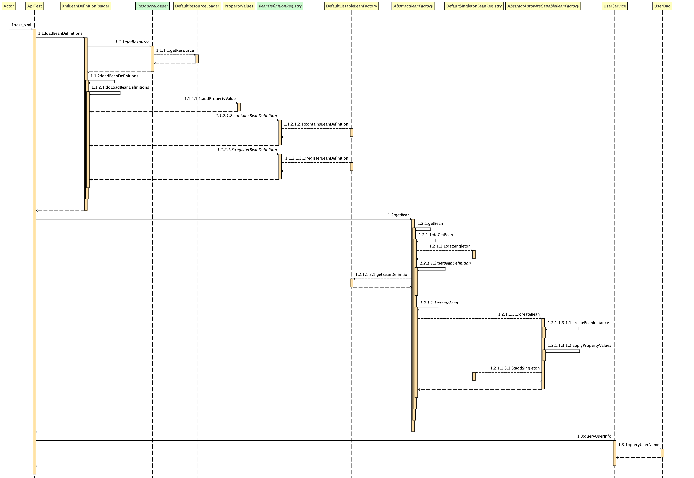

## 资源加载器解析文件注册对象

#### 1.需求目标

- 注入BeanDefinition信息的时候，需要手动操作Bean对象的定义、注册和属性填充，可以将这部分操作通过配置文件的方式完成。
- 支持多种方式加载资源。

#### 2.设计

- 创建Resource接口，提供统一获取字节流的方法getInputStream，并提供三个实现类以不同方式获取。
- 创建ResourceLoader接口，提供获取资源方法getResource(String location)，并提供默认实现类根据不同类型路径，生成不同类型Resource。
- 创建BeanDefinitionReader接口，提供获取BeanDefinition注册器和资源加载器的方法以及解析资源的方法。
- 抽象类AbstractBeanDefinitionReader实现获取BeanDefinition注册器和资源加载器的方法。
- XmlBeanDefinitionReader实现抽象类AbstractBeanDefinitionReader，实现解析资源的方法，提供解析xml的能力，将xml里面的Bean信息填充到BeanDefinition，并通过注册器注册到BeanDefinition容器中。

#### 3.类图

#### 4.时序图

