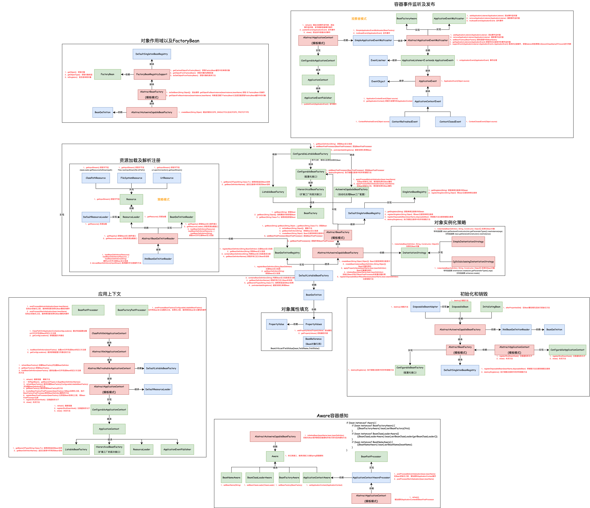
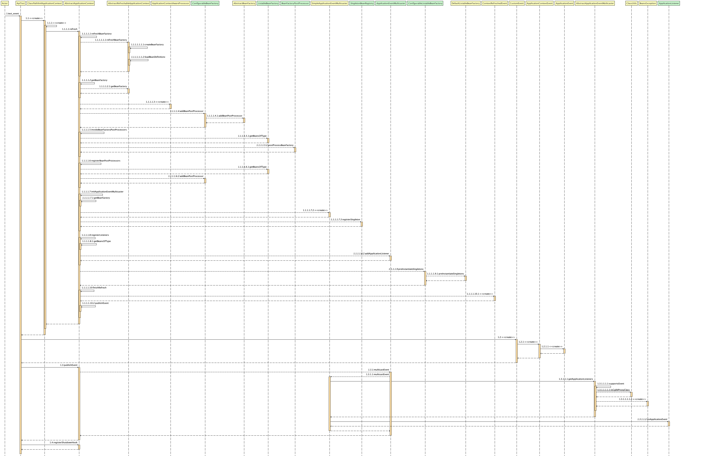

## 容器事件和事件监听器

#### 1.需求目标

- 实现容器事件功能，并支持对事件的监听。

#### 2.设计

- 定义 ApplicationEvent类，后续所有事件的类都需要继承这个类。
- 定义 ApplicationContextEvent类，如果用户想使用Spring框架的容器事件，需要继承这个类。
- 定义 ContextClosedEvent类和ContextRefreshedEvent类，分别是 Spring 框架自己实现的两个事件类，可以用于监听刷新和关闭动作。
- 增加 ApplicationEventMulticaster接口，包括添加监听和删除监听的方法以及一个广播事件的方法 multicastEvent ，最终推送时间消息也会经过这个接口方法来处理谁该接收事件。
- 增加 AbstractApplicationEventMulticaster抽象类，包括基本的增删监听、设置工厂，以及一个getApplicationListeners方法，用于获取对事件感兴趣的监听器。
- 定义 ApplicationEventPublisher接口，所有的事件都需要从这个接口发布出去。
- 在 AbstractApplicationContext的refresh方法中新增三个步骤：初始化事件发布者、注册事件监听器、发布容器刷新完成事件。初始化事件发布者(initApplicationEventMulticaster)，主要用于实例化一个 SimpleApplicationEventMulticaster，这是一个事件广播器。注册事件监听器(registerListeners)，通过 getBeansOfType 方法获取到所有从 spring.xml 中加载到的事件配置 Bean 对象。发布容器刷新完成事件(finishRefresh)，发布了第一个服务器启动完成后的事件，这个事件通过 publishEvent 发布出去，其实也就是调用了 applicationEventMulticaster.multicastEvent(event) 方法。

#### 3.类图

#### 4.时序图

