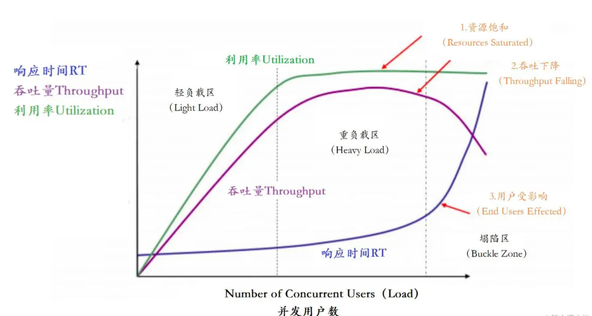

## 一、性能测试概述

### 1.1、性能测试定义

**问题1：什么是压力测试&性能测试？**

压力测试（Stress testing）是针对特定系统或是组件，为要确认其稳定性而特意进行的严格测试。会让系统在超过正常使用条件下运作，然后再确认其结果。 

性能测试就是通过特定的方式对被测试系统按照一定测试策略施加压力，获取该系统的响应时间、TPS、吞吐量、资源利用率等性能指标，来检测系统上线后能否满足用户需求的过程。

总的来说，性能测试会对系统不断施加压力，来预估系统的负载能力。:

**问题2：为什么要对系统进行压测呢？**

 一般而言，只有在系统基础功能测试验证完成、系统趋于稳定的情况下，才会进行压力测试。

**问题3：压测目的是什么？**

1. 当负载逐渐增加时，观察系统各项性能指标的变化情况是否有异常
2. 发现系统的性能短板，进行针对性的性能优化
3. 判断系统在高并发情况下是否会报错，进程是否会挂掉
4. 测试在系统某个方面达到瓶颈时，粗略估计系统性能上限

### 1.2、性能测试的指标

在性能测试的过程中，QPS和TPS是常见的统计指标，衡量一个系统性能的重要指标之一。

- **QPS，**全名 Queries Per Second，意思是每秒查询率，是一台服务器每秒能够响应的查询次数，是对一个特定的查询服务器在规定时间内所处理流量多少的衡量标准。
- **TPS，**即 Transactions Per Second的缩写，每秒处理的事务数目。一个事务是指一个客户机向服务器发送请求然后服务器做出反应的过程。 客户机在发送请求时开始计时，收到服务器响应后结束计时，以此来计算使用的时间和完成的事务个数，最终利用这些信息作出的评估分。

Qps 基本类似于 Tps，但是不同的是，对于一个页面的一次访问，形成一个 Tps；

但一次页面请求，可能产生多次对服务器的请求，服务器对这些请求，就可计入“Qps”之中。

常见的核心指标如下：

1. 响应时间：是指系统对请求做出响应的平均时间，对于单用户的系统，响应时间可以很好的度量系统的性能。
2. 吞吐量：是指系统在单位时间内处理请求的数量，每秒事务数TPS也是吞吐量的一种。
3. 资源利用率：洗头膏的CPU占用率、内存占用率、系统负载、网络I/O、磁盘I/O、中间件的JVM、连接数量等。
4. 并发用户数：是指系统可以同时承载的正常使用系统功能的用户的数量，用户不同的使用模式会导致不同用户在单位时间发出不用数量的请求。
5. 错误率：失败请求占比，在测试时添加响应断言，验证不通过即记为错误；若不添加，响应码非200即为错误。

### 1.3、性能测试的指标的关系图

针对主要的四种性能指标响应时间、并发用户数、吞吐量、资源使用率，它们之间存在一定的相关性，共同反映出性能的不同方面。 这里放一张非常经典的图片：




在这个图中，定义了三条曲线、三个区域、两个点以及三个状态描述。 

- **三条曲线：**

1.  吞吐量的曲线（紫色），表示在不同负载下系统的吞吐量变化情况。吞吐量指的是系统在单位时间内能够处理的请求数量。
2.  利用率（绿色） ，表示在不同负载下系统资源的利用率变化情况。利用率指的是系统资源（如CPU、内存、网络带宽等）的使用程度。
3. 响应时间曲线（深蓝色），表示在不同负载下系统的响应时间变化情况。响应时间指的是系统处理请求所花费的时间。

- **三个区域：**

1.  轻负载区（Light Load） ，表示系统处于较低负载状态，吞吐量高、响应时间低、资源利用率较低。
2. 重负载区（Heavy Load） ，表示系统处于较高负载状态，吞吐量可能达到峰值，响应时间可能增加，资源利用率较高。
3. 塌陷区（Buckle Zone）， 表示系统负载过高，无法正常处理请求，吞吐量下降，响应时间急剧增加，资源利用率过高。

- **两个点：**

1.  最优并发用户数（The Optimum Number of Concurrent Users） ，表示系统负载过高，无法正常处理请求，吞吐量下降，响应时间急剧增加，资源利用率过高。
2. 最大并发用户数（The Maximum Number of Concurrent Users） ，表示系统能够处理的最大并发用户数量。超过该数量，系统的性能可能开始下降，响应时间增加，吞吐量下降。

- **三个状态描述：**

1. 资源饱和（Resource Saturated），表示系统资源已经达到或接近极限，无法满足当前的负载需求。此时，系统的性能可能下降，响应时间增加。
2.  吞吐下降（Throughput Falling），表示系统的吞吐量开始下降，无法处理更多的请求。这可能是由于资源不足或系统负载过高导致的。
3. 用户受影响（End Users Effected） ，表示系统性能下降，影响到最终用户的体验。用户可能遇到延迟、超时或错误等问题。

### 1.4、性能测试的时机

压测的时机很重要，如果时间选择不对，可能会做无用功，简单总结下5个常见的时机：


**1.4.1、上线前压测**

常规操作是在上线前，对系统进行一个摸高压测，根据预估的流量，对系统配置进行优化调整，保证运行期间，系统能正常运行。

**1.4.2、项目上线稳定后，对系统评估**

系统上线后，随着用户量不断增加，承受的压力会越来越大，为了让系统在未来的时间内稳定运行，需要通过压测对系统进行评估，以调整配置或优化接口，来充分应对不断增长的用户量。

**1.4.3、项目研发后期，对系统的检验**

在项目后期，由于领导或团队的要求，需要对系统的稳定性做校验，保证系统短时间内流量陡增时能稳定运行，可以给系统的部署提供参考。

**1.4.4、线上出现性能问题**

有些项目为了抢占市场，节省时间，完成了基本的功能就上线了，没有做压测，当用户突然增加出现线上性能问题后，反过来做压测，这种情况的风险是很大的，不推荐。

**1.4.5、合作方要求**

有些合作方对性能有明确的要求，并且写进了合同，这种情况下就必须去做压测了。

### 1.5、性能测试的步骤

1、需求分析：明确定义性能指标，响应时间、QPS、CPU占用率等

2、基于性能指标定义到实际的性能场景以及测试数据的量级

3、脚本准备：单业务场景、混合场景等

4、执行脚本：关注到关键指标的变化，吞吐量，响应时间等

5、性能诊断：内存、CPU、磁盘IO、网络IO等

### 1.6、性能测试的工具

简单测试场景：

**wrk**：一个快速而现代的HTTP基准测试工具，适用于命令行使用。它支持多线程，能够模拟高并发负载，并提供详细的性能报告。

**ApacheBench (ab工具)**：Apache HTTP服务器附带的工具，用于进行基本的HTTP性能测试。它可以发送并发请求并测量响应时间和吞吐量等指标。

复杂测试场景：

**Apache JMeter**： 

优势：免费且开源，支持多种协议（HTTP、FTP、JDBC等），可模拟高并发负载，具有灵活的测试脚本编写和调试功能。 

使用场景：适用于Web应用程序和Web服务的性能测试，支持复杂的测试场景和流程

**LoadRunner**： 

 优势：功能强大且广泛使用，支持多种协议和技术，具有分布式测试能力，提供可视化的测试脚本录制和编辑工具。 

使用场景：适用于复杂的企业级应用程序和系统的性能测试，支持大规模负载和复杂的测试场景。 

**Locust**：

优势：开源且易于使用，基于Python编写，支持分布式测试，可用于编写可读性强的测试脚本。 

使用场景：适用于Web应用程序和API的性能测试，具有简单的脚本编写和扩展性。

### 1.7、性能测试监控工具

Linux系统的命令：top、vmstat、iostat、ss、netstat

可视化监控：Prometheus+Grafana+InfluxDB+Skyworking

其他监控工具：nmon、arthas

## 二、性能测试的类型

- 基准测试
- 负载测试
- 压力测试
- 峰值测试
- 并发测试
- 容积测试
- 稳定性测试
- 配置测试 

## 三、JMeter的下载和安装

JMeter是Apache组织开发的基于Java的压力测试工具。用于对软件做压力测试，它最初被设计用于Web应用测试，但后来扩展到其他测试领域。不仅体积小功能全，而且使用起来也非常方便和简单。 它可以用于测试静态和动态资源，例如静态文件、Java 小服务程序、CGI 脚本、Java 对象、数据库、FTP 服务器等等。

### 3.1、下载

下载地址：https://jmeter.apache.org/download_jmeter.cgi

### 3.2、安装与启动

下载后，提前配置好Java的环境变量，然后解压ZIP压缩包，双击启动bin目录下的jmeter.bat文件即可

### 3.3、常用的基础配置

为了符合我们日常测试的习惯，需要修改某些基础的配置。具体如下：

**3.3.1、修改页面配置为中文语言**

在JMeter的bin的目录下，编辑jmeter.properties文件中的国际化配置选项，打开或取消如下注释，并更改为中文配置，大概在文件的39行：

```bash
复制代码#Preferred GUI language. Comment out to use the JVM default locale's language.
language=zh_CN
```

**3.3.2、更改配置解决响应乱码的问题**

在JMeter的bin的目录下，编辑jmeter.properties文件的编码配置，大概在文件的1098行：

```bash
# The encoding to be used if none is provided (default ISO-8859-1)
sampleresult.default.encoding=UTF-8
```

从 JMeter 5.6.1版本开始，默认调整为了UTF-8

**3.3.3、更改默认启动内存**

当并发数量过多时，JMeter内存配置不满足此时并发需求，会导致请求出现异常使结果不正确。Windows下右键编辑jmeter/bin/jmeter.bat，默认是1G的内存，修改以下配置即可：

```bash
# 修改Xmx的值来增大JMeter内存配置
set HEAP=-Xms1g -Xmx2g
```

### 3.4、常用的插件安装

通过插件可以更好的帮助我们完成测试。

**3.4.1、JMeter插件管理器下载**

该插件是一个管理插件的插件。下载地址：https://jmeter-plugins.org/downloads

**3.4.2、待安装的插件列表**

1、Basic Graphs（可选插件的前两个）

2、Additional Graphs （可选插件的前两个）

3、jpgc - Standard Set (最后一个）  

4、PerfMon (Servers Performance Monitoring)     

## 四、JMeter案例步骤

1. 启动JMeter添加线程组
2. 为线程组添加HTTP请求
3. 为线程组添加汇总报告
4. 为线程组添加聚合报告
5. 为线程组添加查看结果树
6. 开始执行测试