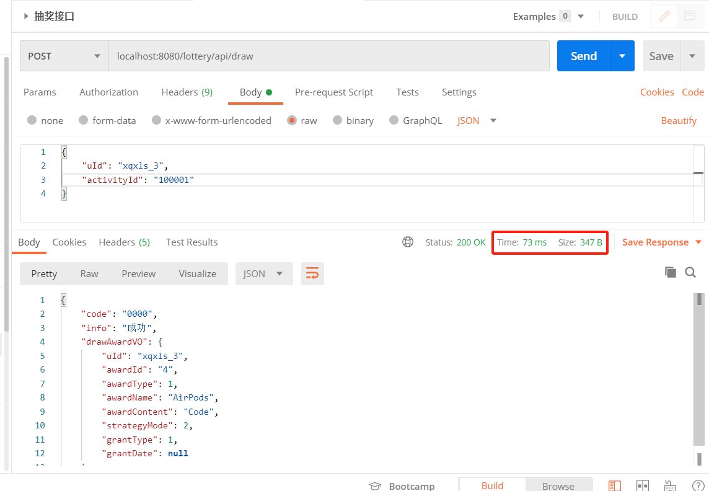
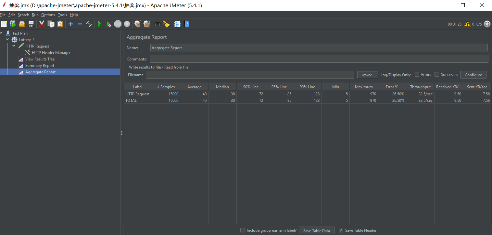

## 一、定义Restful接口

核心代码：

```java
@RestController
@RequestMapping("lottery/api")
public class LotteryController {

    private Logger logger = LoggerFactory.getLogger(LotteryController.class);

    @Resource
    private IActivityProcess activityProcess;

    @RequestMapping(value = "/draw", method = RequestMethod.POST)
    public DrawProcessResult draw(@RequestBody DrawProcessReq req) {
        DrawProcessResult result = activityProcess.doDrawProcess(req);
        logger.info("请求入参：{}", JSON.toJSONString(req));
        logger.info("测试结果：{}", JSON.toJSONString(result));
        return result;
    }
}
```

## 二、Postman模拟调用

Postman模拟调用Restful接口，需要关注接口的响应时间和数据包大小。数据包大小会影响到带宽占用，响应时间影响到压测参数的设置，可以通过响应时间算出线程组中执行的总时长。



## 三、梯度压测

逐渐增加并发，观察系统的负载，找到系统的临界点




线程数：根据接口的响应时间来决定，如果很短，就可以用很少的线程数，反之用较多的线程数

循环次数：接口响应时间*循环次数=执行样本的时间，可以控制线程组在多长时间内执行完成

| 线程数 | 循环次数 | 样本数 |
| ------ | -------- | ------ |
| 5      | 1000     | 5000   |
| 5      | 2000     | 10000  |

当样本数达到10000的时候，出现数据库连接超时错误，后续需要调整数据库连接池参数