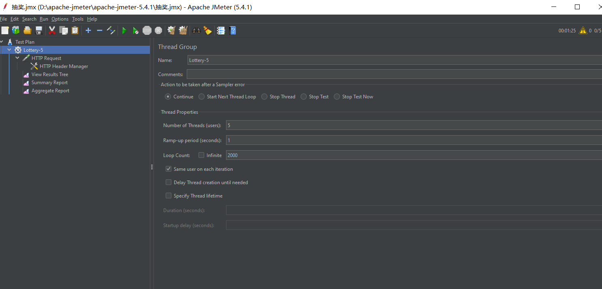

## 一、定义Restful接口

核心代码：

```java
@RestController
@RequestMapping("lottery/api")
public class LotteryController {

    private Logger logger = LoggerFactory.getLogger(LotteryController.class);

    @Resource
    private IActivityProcess activityProcess;

    @RequestMapping(value = "/draw", method = RequestMethod.POST)
    public DrawProcessResult draw(@RequestBody DrawProcessReq req) {
        DrawProcessResult result = activityProcess.doDrawProcess(req);
        logger.info("请求入参：{}", JSON.toJSONString(req));
        logger.info("测试结果：{}", JSON.toJSONString(result));
        return result;
    }
}
```

## 二、Postman模拟调用

Postman模拟调用Restful接口，需要关注接口的响应时间和数据包大小。数据包大小会影响到带宽占用，响应时间影响到压测参数的设置，可以通过响应时间算出线程组中执行的总时长。


## 三、梯度压测

逐渐增加并发，观察系统的负载，找到系统的临界点




线程数：根据接口的响应时间来决定，如果很短，就可以用很少的线程数，反之用较多的线程数

循环次数：接口响应时间*循环次数=执行样本的时间，可以控制线程组在多长时间内执行完成

| 线程数 | 循环次数 | 样本数 |
| ------ | -------- | ------ |
| 5      | 1000     | 5000   |
| 5      | 2000     | 10000  |
| 10     | 4000     | 40000  |
| 20     | 4000     | 80000  |
| 25     | 4000     | 100000 |
| 30     | 4000     | 120000 |
| 35     | 4000     | 140000 |
| 40     | 4000     | 160000 |
| 45     | 4000     | 180000 |
| 50     | 4000     | 200000 |

当样本数达到10000的时候，出现数据库连接错误。

## 四、调整TCP参数

当样本数达到10000时，报错如下：


经过分析是由于windows系统下tcp连接默认限制为500，需要修改注册表，调整tcp连接参数

1.修改TcpTimedWaitDelay参数

TcpTimedWaitDelay参数是指确定 TCP/IP 可释放已关闭连接并重用其资源前，必须经过的时间。关闭和释放之间的此时间间隔通称 TIME_WAIT 状态或两倍最大段生命周期（2MSL）状态。此时间期间，重新打开到客户机和服务器的连接的成本少于建立新连接。减少此条目的值允许 TCP/IP 更快地释放已关闭的连接，为新连接提供更多资源。如果运行的应用程序需要快速释放和创建新连接，而且由于 TIME_WAIT 中存在很多连接，导致低吞吐量，则调整此参数。


2.修改MaxUserPort参数

MaxUserPort参数是指确定在应用程序从系统请求可用用户端口时，TCP/IP 可指定的最高端口号。


修改参数之后，不再报jdbc连接错误


## 五、添加csv数据配置，模拟多用户并发访问

脚本准备：

```java
@Slf4j
@Component
public class UserUtil {
    public static void main(String[] args) throws Exception{
        createCsvConfig();
    }

    private static void createCsvConfig() throws Exception {
        File file = new File("C:\\Users\\86183\\Desktop\\config.txt");
        if(file.exists()){
            file.delete();
        }
        RandomAccessFile raf = new RandomAccessFile(file,"rw");
        raf.seek(0);
        for(int i=1;i<=200000;i++){
            String uId = "xqxls_" + i;
            String activityId = "100009";
            log.info("create uId:"+uId);
            String row = uId+","+activityId;
            raf.seek(raf.length());
            raf.write(row.getBytes());
            raf.write("\r\n".getBytes());
            log.info("write to file:"+uId);
        }
        raf.close();
        log.info("over……");
    }
}
```

jmeter添加csv-data配置：


## 六、引入Druid数据源连接池

db-router-spring-starter添加如下依赖，重新install

```xml
<dependency>
    <groupId>com.alibaba</groupId>
    <artifactId>druid-spring-boot-starter</artifactId>
    <version>1.2.18</version>
</dependency>
```

lottery主pom下进行如下修改：

```xml
<dependency>
    <groupId>cn.bugstack.middleware</groupId>
    <artifactId>db-router-spring-boot-starter</artifactId>
    <version>1.0.1-SNAPSHOT</version>
    <exclusions>
        <exclusion>
            <groupId>org.glassfish.jaxb</groupId>
            <artifactId>jaxb-runtime</artifactId>
        </exclusion>
    </exclusions>
</dependency>
```

引入连接池之后，TPS在300左右：

